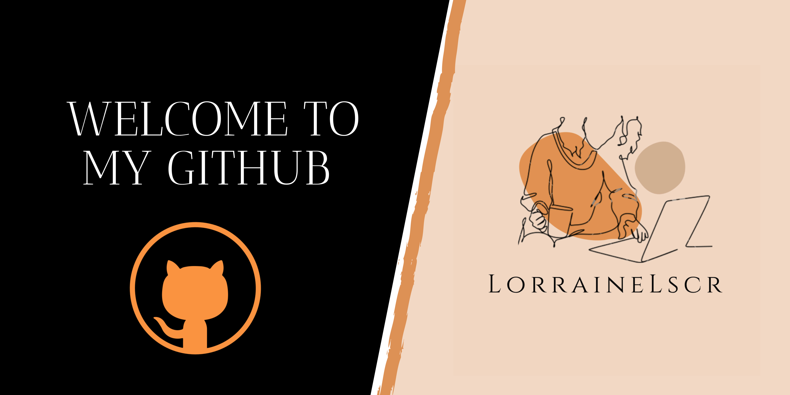

<h1 align="center">Hi 👋, I'm Lorraine</h1>

<h3 align="center"> 💻  I am training to become a software developer.  📱</h3>

<h2 align="left">I code with :</h2>

  
  
  
  
  
  
  
  
  
  
  
  
  
  

###

<h2 align="left">Connect with me :</h2>

###

###
